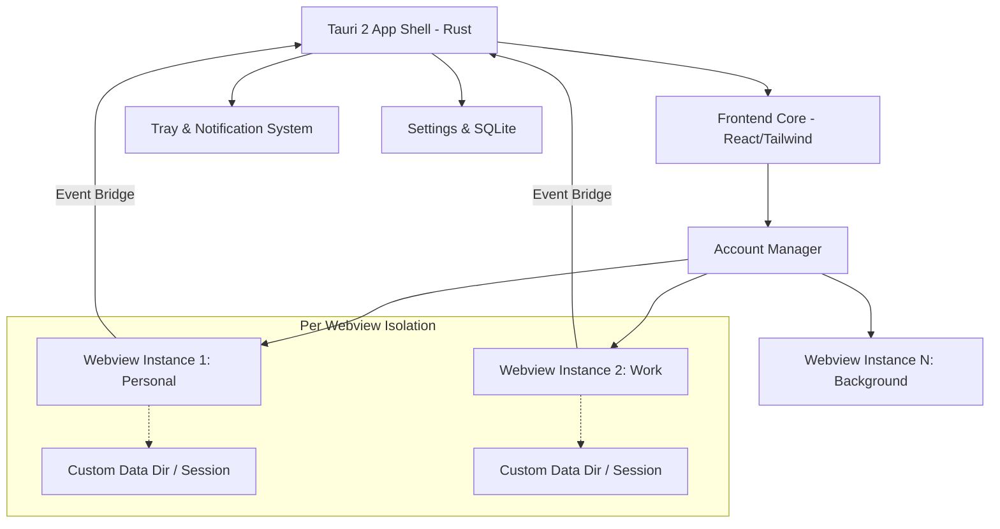

# Architecture & Implementation Plan: Wapex (Tauri 2)

## 1. Product Definition & Vision

The goal is to move beyond the traditional "wrapper" model and build **Wapex**—a **productivity-first communication hub**. This application is designed for power users who manage multiple identities (Personal, Business, Freelance) and need a desktop experience that is faster and more capable than a set of browser tabs.

### Vision Statement
*“Wapex: A refined desktop experience that unifies multiple WhatsApp identities into a single, high-performance workspace, prioritizing productivity, privacy, and seamless system integration.”*

### Core Pillars
- **Performance:** Sub-second account switching and low memory footprint despite multiple sessions.
- **Organization:** Workspace-based grouping (e.g., "Work" vs "Personal") to prevent context switching.
- **Integration:** Deep OS-level integration (Tray, Global Shortcuts, Quick Replies).

### 20 Differentiating Premium Features
1.  **Multi-Account Workspaces:** Group accounts into "Work", "Personal", and "Client" workspaces.
2.  **Unified Unread Count:** A single badge on the Dock/Taskbar reflecting the total unread across all sessions.
3.  **Global Command Palette (Cmd + K):** Quickly switch accounts, search for a chat, or jump to settings.
4.  **Isolated Session Profiles:** Zero cross-contamination between cookies, local storage, and IndexedDB.
5.  **Smart Hibernation:** Automatically puts inactive accounts to "sleep" (suspending the webview process) when memory usage exceeds a threshold.
6.  **Quick-Reply Overlays:** A native macOS/Windows overlay to reply to a message without opening the full app.
7.  **Universal Search Layer:** (V2) Indexing chat titles locally for instant "all-account" search.
8.  **Account Aesthetic Color-Coding:** Subtle window border or sidebar accents based on the active account's assigned color.
9.  **Automated Focus Mode:** Mute specific accounts/workspaces based on a schedule or manual toggle.
10. **Privacy Blur:** Automatically blurs the active chat when the window loses focus for $N$ seconds.
11. **Chat Pop-outs:** Open a single WhatsApp chat window into its own minimal, floating window.
12. **Custom CSS/Injectors:** Built-in "premium" dark mode and UI decluttering (hiding ads/promos).
13. **Native Notification Proxy:** Bridging Web Notifications to Native OS notifications with custom "Mark as Read" and "Reply" actions.
14. **Status Synchronizer:** Sync your WhatsApp "Busy" status with other desktop apps (Slack, Teams).
15. **Pinned Chats Across Accounts:** Pin important chats (e.g., a specific client) to a universal sidebar.
16. **Session Auto-Restore:** Intelligent recovery if a specific account webview crashes, without affecting others.
17. **Global Hotkeys:** Custom shortcuts for "Mute All", "Switch Account 1", "Search All".
18. **Onboarding QR Dashboard:** A clean grid view to see which accounts need pairing/re-pairing.
19. **Network-Aware Reconnection:** Smarter handling of flaky connections than the standard browser tab.
20. **Security Vault:** Encrypting the local settings and configuration (not the sessions, which are handled by the webview).

---

## 2. Feasibility & Constraints Analysis

### What can be done safely?
- **Webview Isolation:** Using separate data directories ensures sessions are 100% isolated.
- **DOM Injection:** Injecting CSS for styling and JS for event bridging (message counts, notification listening).
- **Window Management:** Controlling window size, position, and transparency via Tauri's Rust API.
- **System Tray/Notifications:** Fully native and reliable using Tauri 2 plugins.

### What is difficult/fragile?
- **Message Automation:** Directly interacting with the message input DOM is risky as WhatsApp updates their class names frequently.
- **Heavy Scraping:** Constant DOM polling for "Universal Search" can lead to performance degradation or being flagged by WhatsApp (though unlikely for simple search).
- **Background Loading:** Keeping 5+ heavy Chrome-based webviews active in the background is memory-intensive.

### What should be avoided?
- **Modified APIs:** Do not use unofficial WhatsApp APIs or "headless" browsers like Puppeteer for primary interactions, as these carry high ban risks.
- **Bypassing QR:** Any attempt to bypass the official QR login flow is a violation of ToS and technically unstable.

---

## 3. High-Level Architecture

The architecture follows a "Shell & Engines" model.

### Overall System Diagram


### Module Responsibilities
- **Rust Side:**
    - Window lifecycle management.
    - Path resolution for account-specific data directories.
    - Multi-tenant event dispatcher (routing webview events back to the UI).
    - SQLite for storing account metadata (names, colors, workspace IDs).
- **Frontend Side (Control Plane):**
    - The "Main Window" UI (Sidebar, Workspace Switcher, Command Palette).
    - Handling the "Add Account" flow.
    - Global state (active account, unread counts).
- **Webview Instances (The Engines):**
    - Each instance is a child webview or a hidden window.
    - **Injected Script (`bridge.js`):** Listens for DOM changes (unread count) and notifies the Rust side.

---

## 4. Multi-Account Design

### Isolation Strategy
Each WhatsApp account must operate in a completely isolated environment to avoid cookie-cross-contamination.
- **Technical Choice:** Use a unique `user_data_dir` for each webview instance.
- **Tauri 2 Implementation:** When creating a `WebviewWindow`, dynamically construct a unique path: `~/.local/share/[app-id]/profiles/[account-id]`.
- **Persistence:** Cookies, IndexedDB, and LocalStorage are isolated into these directories.

### Account Switching Behavior
- **Pragmatic MVP:** One "Active" webview visible in the main frame. Other accounts are "Dormant" (inactive hidden webviews).
- **Ideal/Scale:** Maintain one hidden "Worker" webview per account to catch real-time notifications, while the "Active" account is rendered in the foreground.
- **Balance:** To save RAM, the app should offer an "Aggressive Hibernate" mode where hidden accounts are killed and only re-spawned on a timer or manual switch.

---

## 5. UX / Product Experience Design

### Layout Structure
- **Global Sidebar (Left):** Workspace icons + Workspace settings.
- **Account Strip (Inner Left):** Icons/Initials for accounts within the workspace.
- **Main Context (Center/Right):** The embedded WhatsApp Web view.
- **Status Bar (Bottom):** Sync status, RAM usage (optional for power users), current workspace.

### Core Flows
1.  **Onboarding:** Workspace creation -> "Add First Account" -> QR Pairing.
2.  **QR Pairing:** Clean, branded modal with pairing instructions.
3.  **Command Palette:** `Cmd+K` opens a search bar for accounts and actions.

---

## 6. Feature Roadmap

### Phase 1: MVP (Core Foundation)
- [ ] Single account session persistence.
- [ ] Basic shell UI with Tailwind/Shadcn.
- [ ] Tauri 2 window management (minimizing to tray).
- [ ] Reliable "Unread" bridge.

### Phase 2: V1 (The Multi-Account App)
- [ ] Multi-account switching (Fast Swap).
- [ ] Unique data directories per account.
- [ ] Sidebar for account navigation.
- [ ] Native Notifications with metadata.

### Phase 3: V2 (The Productivity Hub)
- [ ] Workspace grouping.
- [ ] Command Palette (`Cmd+K`).
- [ ] Smart Hibernation for RAM management.
- [ ] Privacy Blur & Auto-lock.

---

## 7. Engineering Plan

### Step 1: Project Setup (Days 1-2)
- Initialize Tauri 2 with Vite/React.
- Setup Tailwind + Shadcn.
- Configure SQLite (tauri-plugin-sql) for account metadata.

### Step 2: Architecture Foundation (Days 3-5)
- Implement `AccountManager` in Rust.
- Logic for dynamic profile path generation.
- Window spawning logic with individual session data.

### Step 3: Multi-Session Logic (Days 6-8)
- Implement the hidden "Worker" webview pool.
- Create the event bridge `bridge.js` to catch unread counts and notifications.

---

## 8. Security, Privacy, & Reliability

- **Credential Security:** WhatsApp tokens remain in the webview cookie jar. We never touch them.
- **Local Settings:** Enforce disk encryption if possible or restrict access via file permissions.
- **Webview Hardening:** 
    - Disable context menus inside the WhatsApp webview.
    - Enable strict CSP.
    - Disable file access for the webview.

---

## 9. Performance Strategy

- **Lazy Loading:** Load the last active account at boot, lazy load others on click.
- **Memory Triage:** Kill webviews of inactive accounts if RAM exceeds 1GB.
- **Polling Optimization:** Use MutationObserver in `bridge.js` instead of `setInterval` for unread count detection.

---

## 10. Suggested Folder Structure

```markdown
├── src-tauri/
│   ├── src/
│   │   ├── account/          # Account logic, path management
│   │   ├── commands/         # Invokable Rust commands
│   │   ├── storage/          # SQLite models
│   │   └── main.rs
│   └── Cargo.toml
├── src/
│   ├── components/           # UI (Sidebar, Switcher)
│   ├── hooks/                # useAccount, useNotifications
│   ├── lib/                  # Utility functions
│   ├── pages/                # App views
│   └── App.tsx
├── static/                   # Injected scripts (bridge.js)
```

---

## 11. Testing Strategy

- **Unit Tests (Rust):** Profile path generation.
- **Integration Tests (Tauri):** Cookie isolation check between multiple windows.
- **Compatibility Testing:** Automated check for WhatsApp Web DOM changes.

---

## 12. Risks & Final Recommendation

### Top Risks
1.  **WA Revamp:** Major WA Web updates breaking DOM-based unread counts.
2.  **Memory Leak:** Multiple webview instances consuming too much RAM.

### Recommended Choice
**Wapex Hybrid Architecture:** One visible "Primary" webview and hidden "Worker" webviews for background notifications. Focus on sub-second switching speed as the primary selling point.
